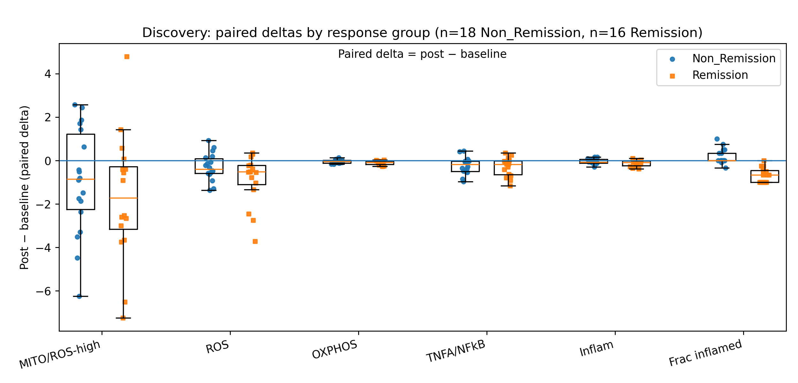
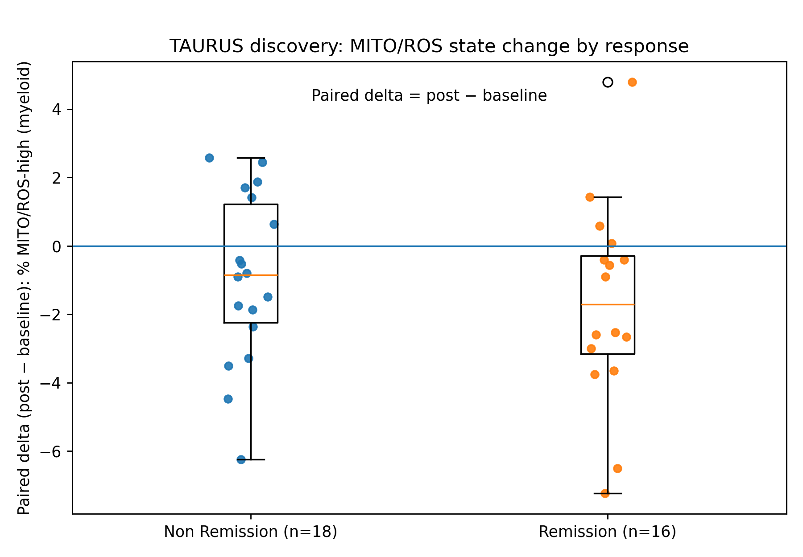
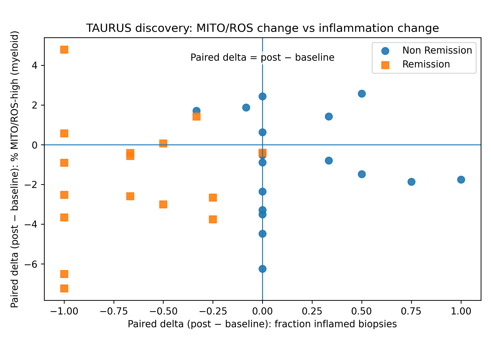
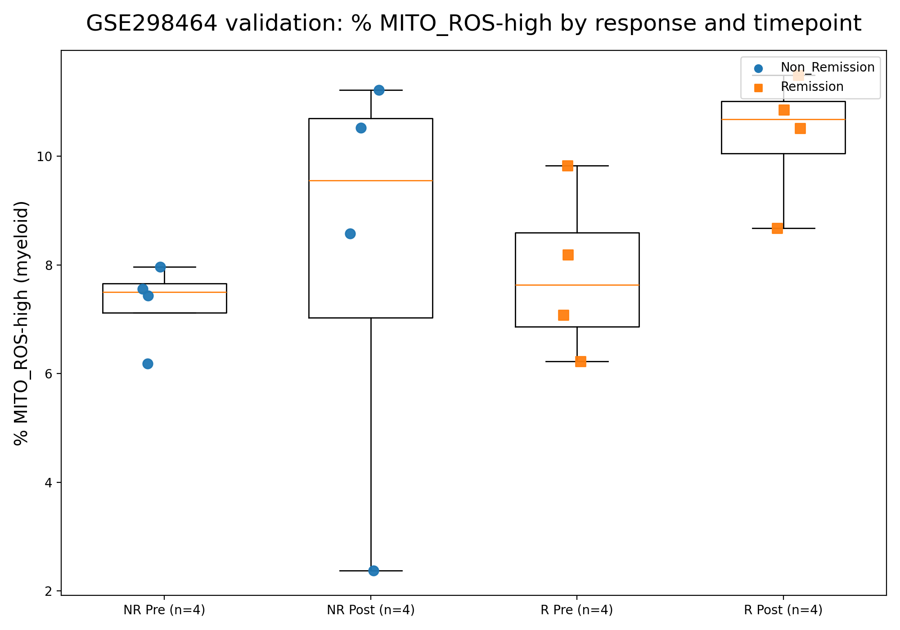
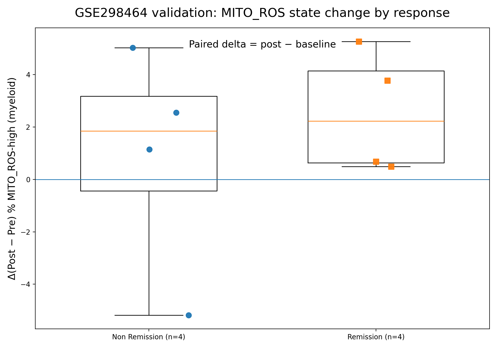

# Results

This page summarizes the key discovery results and the external validation.

> Note: Figures shown here are copied into `docs/assets/figures/` for easy viewing in GitHub.

---

## Discovery (primary)

### Figure 1 — Paired deltas by clinical response (Remission vs Non_Remission)

**Takeaways (discovery):**
- Subjects who reached **Remission** show larger decreases (post − baseline) in **ROS**, **OXPHOS**, and **inflammatory response** signals compared with **Non_Remission**.
- The **MITO/ROS-high fraction** also decreases more in Remission on average.
- This supports an “immune-state normalization” interpretation in the Remission group.

---

### Figure S1 — Overall paired within-subject changes (all subjects pooled)

**Takeaways (discovery):**
- We quantify **within-subject change** (post − baseline) to reduce between-person variability.
- The pooled view summarizes the overall direction across all subjects, but can hide subgroup differences.

---

### Figure 1b — Relationship to inflammation

**Takeaways (discovery):**
- The mito/ROS signal is compared against an inflammation-related signal to contextualize biology.
- The plot helps separate “general inflammation” from a more specific mitochondrial/oxidative pattern.

---

### Figure 1c–1d — Mean delta summaries

**Takeaways (discovery):**
- These panels provide compact summaries of mean changes in ROS- and OXPHOS-related measures.
- Together they support the primary mito/ROS change pattern.

---

## Validation (external)

### Figure V1 — Validation cohort group comparison

**Takeaways (validation):**
- The key mito/ROS pattern is evaluated in an independent dataset (GSE298464).
- This is a first-pass validation intended to check directional consistency.

---

### Figure V2 — Validation paired deltas

**Takeaways (validation):**
- The same paired-delta logic is applied to the validation cohort where pairing is available.
- Agreement in direction strengthens confidence that the discovery signal is not dataset-specific.

---

## Where to find the underlying tables

Discovery:
- `results/tables/state_summary.tsv`
- `results/tables/paired_subject_deltas.tsv`
- `results/tables/paired_subject_deltas_with_metadata.tsv`

Validation (if generated):
- `results/tables/validation_gse298464/`
